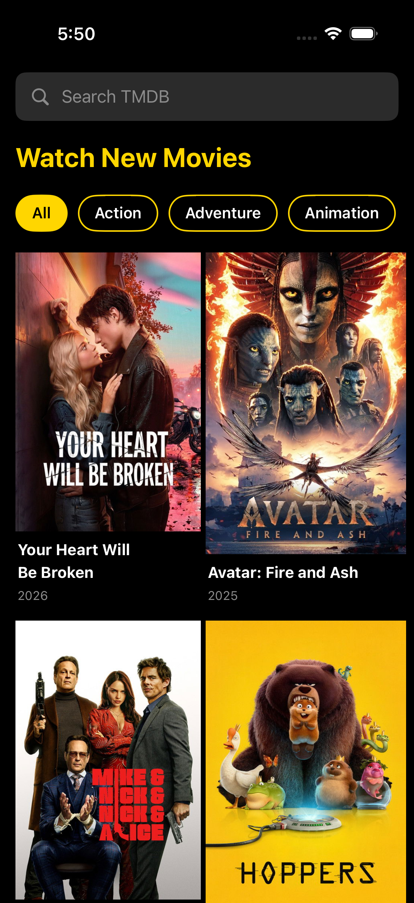
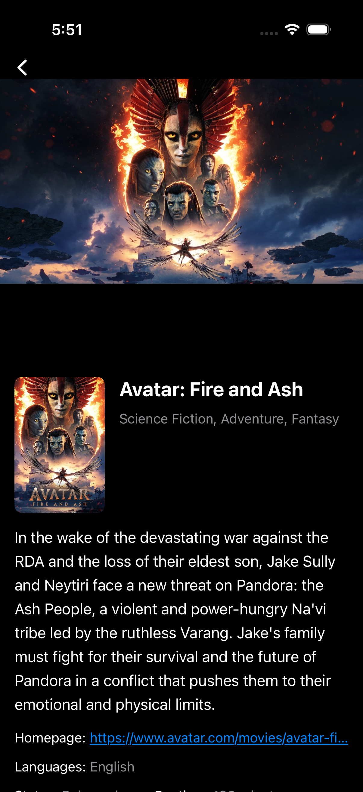
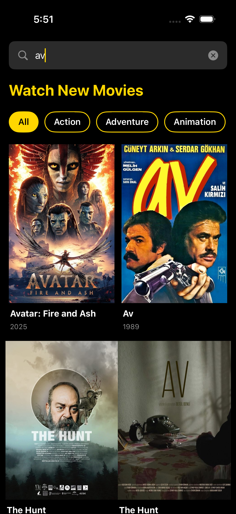

# Movies

A SwiftUI iOS app for discovering and browsing movies.

<p align="center">
  
  
  
  
</p>

---

## Features

- Browse trending and popular movies
- Filter movies by genre
- Search movies with debounced input
- Full movie detail screen (poster, backdrop, genres, budget, revenue, runtime, and more)
- Offline support — cached pages are served when there is no internet connection
- Genre selection persisted across app launches via SwiftData
- Search history stored locally

---

## Architecture

The project follows **Clean Architecture** with a feature-based folder structure.

```
Movies/
├── Core/
│   ├── Domain/               # Business rules — no UIKit/SwiftUI/network imports
│   │   ├── Entities/         # Movie, MovieDetail, Genre, PaginatedMoviesResult
│   │   ├── Repositories/     # Protocol contracts (MoviesRepositoryProtocol, ConnectivityStatusProviding)
│   │   └── UseCases/         # GetMoviesUseCase, GetGenresUseCase, GetMovieDetailsUseCase
│   └── Data/                 # Concrete implementations
│       ├── DTOs/             # API response models (MovieDTO, MovieDetailDTO, …)
│       ├── Mappers/          # DTO → Domain entity converters
│       ├── Repositories/     # MoviesRepository
│       └── DataSources/
│           ├── Remote/       # NetworkClient, MoviesRemoteDataSource, APIConstants
│           └── Local/        # MovieListDiskCache, ReachabilityService, CachedMovieDetail
├── Features/
│   ├── Home/
│   │   ├── Views/            # HomeView, MovieGridView, CategoryView, SearchBarView, …
│   │   └── ViewModels/       # HomeViewModel
│   └── MovieDetail/
│       ├── Views/            # MovieDetailView, MovieDetailsHeaderView, MovieInfoSection, …
│       └── ViewModels/       # MovieDetailViewModel
├── DI/                       # Resolver (service-locator style dependency injection)
├── Persistence/              # UserPreferences (SwiftData model)
└── Theme/                    # AppTheme (colors, typography constants)
```
---

## Tech Stack

| Concern | Solution |
|---|---|
| UI | SwiftUI |
| State management | `@MainActor` + `ObservableObject` + Combine |
| Persistence | SwiftData (`CachedMovieDetail`, `UserPreferences`) |
| Networking | `URLSession` wrapped in `NetworkClient` |
| Reachability | `NWPathMonitor` via `ReachabilityService` |
| Movie data | TMDB REST API v3 |

---

## Requirements

- Xcode 16+
- iOS 17+
- A valid [TMDB API key](https://developer.themoviedb.org/docs/getting-started)

---

## Setup

1. Clone the repository.
2. Open `Movies.xcodeproj` in Xcode.
3. In `Movies/Core/Data/DataSources/Remote/APIConstants.swift`, replace the value of `apiKey` with your own TMDB API key.
4. Select an iOS 17+ simulator or device and run the scheme **Movies**.

> **Note:** The app runs without an API key but all network requests will fail with a `401` error. The offline cache will still work if data was previously fetched.

---

## Running Tests

Select the **MoviesTests** scheme and press **⌘ U**, or run from the terminal:

```bash
xcodebuild test \
  -project Movies.xcodeproj \
  -scheme Movies \
  -destination 'platform=iOS Simulator,name=iPhone 16'
```

### Test Coverage

| Area | Test files |
|---|---|
| Use Cases | `GetMoviesUseCaseTests`, `GetGenresUseCaseTests`, `GetMovieDetailsUseCaseTests` |
| Mappers | `MovieMapperTests`, `GenreMapperTests`, `MovieDetailMapperTests` |
| Repository | `MoviesRepositoryTests` |
| ViewModels | `HomeViewModelTests`, `MovieDetailViewModelTests` |

All tests use protocol-based mocks and the Swift Testing framework (`@Test`, `#expect`).

---

## Project Decisions

### Why a custom `Resolver` instead of a DI framework?
The app has a small, well-defined dependency graph. A lightweight service locator avoids an external dependency while still keeping `View` and `ViewModel` construction decoupled and testable.

### Why actor-based disk cache?
`MovieListDiskCache` is an `actor` to guarantee safe concurrent reads/writes without manual locking, leveraging Swift's structured concurrency model.

### Why `ConnectivityStatusProviding` protocol?
`ReachabilityService` lives in the Data layer. Exposing it as a protocol keeps the Domain and Presentation layers independent of any `Network` framework import.
